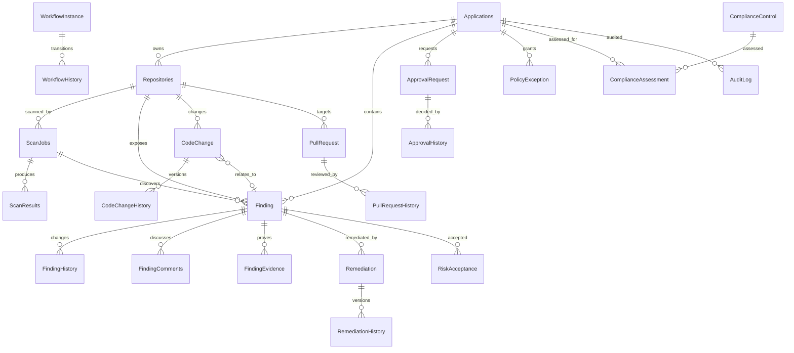

# Security Governance logical ERD

`history.*` is append-only event history; `audit.AuditLog` is the centralized cross-entity audit stream. `dbo.*` and `workflow.*` are current-state projections used for efficient reads. `security.Users` supplies actor identity and is referenced by command records.

## History-screen query model

Every entity history tab should call a server-side endpoint that unions its domain history stream with `audit.vw_UnifiedTimeline`, ordered by UTC timestamp and `AuditId`/history key. The client must not reconstruct history from current API payloads. Timeline entries should include actor, action, reason/comment, previous value, new value, and evidence/change references.

## Reporting model

Reports are read-only projections over the audit/history views. A report request itself is persisted as `UserActivity` plus an `EXPORT` audit event; the generated artifact should be stored outside SQL with a content hash in an evidence or report artifact table in the next migration.