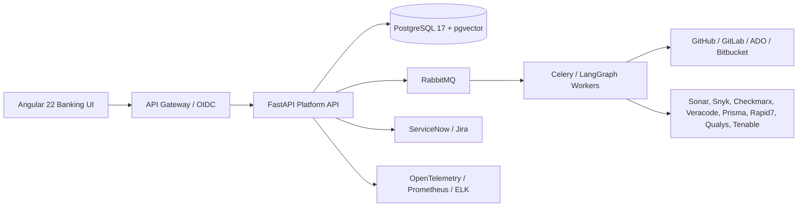

# Enterprise Architecture

### Service decomposition

The API contracts map to independently deployable bounded contexts: identity, authorization, mnemonic/application/repository inventory, vulnerability ingestion, AI classification/remediation, validation, approvals, PR/deployment, notifications, compliance, audit/reporting, copilot/knowledge graph, integrations, and scheduling. Start as a modular monolith for contract validation, then extract services behind events and an outbox as scale and ownership require.

### Reliability

Use PostgreSQL HA, RabbitMQ quorum queues, Redis Sentinel/Cluster, multi-zone Kubernetes, PodDisruptionBudgets, idempotency keys, transactional outbox, retries with jitter, dead-letter queues, and progressive delivery. Target 99.99% availability with active/standby regional DR and quarterly restore exercises.
