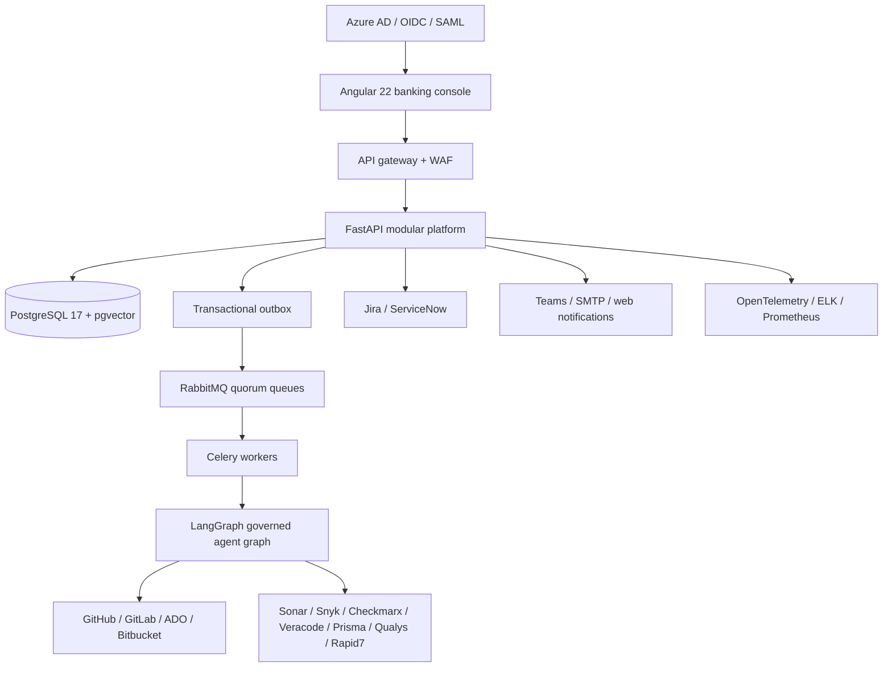
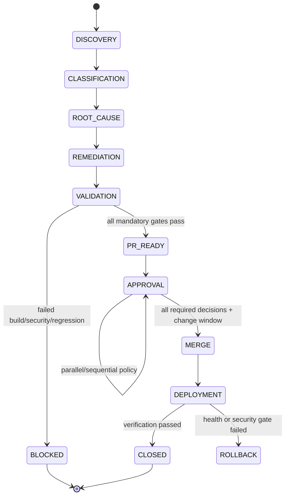

# PNC Vuln AI — Enterprise Production Blueprint

This document is the implementation contract for a regulated banking deployment.
It deliberately separates **recommendation** from **change execution**: AI can
classify, plan, and prepare a PR, but it cannot bypass validation, policy, or the
approval matrix.

## 1. Architecture

Start as a modular monolith with clear bounded-context packages and an outbox.
Extract ingestion, agent execution, reporting, and notifications when measured
load or ownership requires it. This avoids distributed-transaction failure modes.

## 2. Bounded contexts and API ownership

| Context | Responsibilities | Primary API surface |
|---|---|---|
| Identity/access | OIDC login, tenant resolution, RBAC/ABAC | `/auth`, principal middleware |
| Portfolio | mnemonic → application → repository hierarchy | `/catalog` |
| Discovery | scanner webhooks, normalized scan runs, deduplication | `/scans/import` |
| Risk | CVE/CWE enrichment, clustering, SLA scoring | `/vulnerabilities` |
| Remediation | plans, branches, validation, PRs | `/remediation`, `/pull-requests` |
| Governance | approvals, change records, audit | `/approvals`, `/audit` |
| Delivery | deployment status and rollback evidence | `/deployments` |
| Intelligence | embeddings, knowledge graph, copilot | `/copilot`, `/knowledge-graph` |
| Reporting | asynchronous PDF/CSV/XLSX evidence packages | `/reports` |

All mutating calls accept an idempotency key. All records carry `tenant_id`.
RLS is defense in depth; application authorization is still mandatory.

## 3. AI agent state machine

Agent controls: least-privilege short-lived SCM tokens, repository allowlists,
network egress policy, prompt/model version capture, retrieved evidence, output
schema validation, secret redaction, confidence thresholding, and human approval.
No model output is executed as shell code. Patches are applied in isolated,
ephemeral workers and validated against the target commit.

## 4. Data model

Core entities are tenants, users, roles/permissions, teams, mnemonics,
applications, repositories, scan runs, vulnerabilities, CVEs/CWEs, remediation
actions, AI recommendations, branches, pull requests, validation/security scans,
approval workflows/history, deployments, notifications, external tickets,
knowledge graph nodes/edges, compliance evidence, reports, and immutable audit
events. Migration `003_enterprise_capabilities.sql` adds the operational entities
needed for 100,000+ findings and 10,000+ repositories.

Partition vulnerabilities by discovery time and audit events by occurrence time.
Use `(tenant_id, status)`, `(tenant_id, severity)`, repository scan, notification,
and report indexes. Store raw scanner artifacts in encrypted object storage; keep
only normalized searchable data in PostgreSQL.

## 5. Security architecture

- Azure AD/OIDC is the production identity authority; local login is demo-only.
- JWT issuer, audience, signature, expiry, tenant, and role claims are validated.
- RBAC is combined with resource-level ownership and tenant isolation.
- PostgreSQL RLS is enabled for high-risk tenant tables.
- Secrets use a cloud secret manager/CSI driver; Kubernetes manifests are examples,
  not a substitute for secret-manager integration.
- TLS 1.2+, mTLS service mesh where required, private database endpoints, WAF,
  egress allowlists, NetworkPolicies, non-root read-only containers, signed images,
  SBOMs, Trivy scanning, and admission policy are mandatory.
- Audit events are append-only, time-synchronized, retained per policy, exported
  to immutable storage, and correlated with `X-Correlation-ID`.
- AI safety includes prompt-injection resistance, repository content isolation,
  data-loss prevention, model allowlists, evaluation sets, and kill switches.

## 6. Approval policy

Critical/internet-exposed/RCE/credential findings require application, security,
manager, compliance, and production-change approvals. High-confidence dependency
patches may use parallel application/security approval, but production merge still
requires a change window and successful CI. Medium/low confidence fixes always
require human review. Auto-merge is prohibited when validation is incomplete,
policy evidence is stale, or the target branch is protected.

## 7. Reliability and scale

Target SLO: 99.99% API availability, p95 read latency under 300 ms, p95 queued
workflow acceptance under 2 s. Use three API replicas minimum, HPA, PDB, multi-zone
PostgreSQL HA, RabbitMQ quorum queues, Redis HA, outbox retries, DLQs, and bounded
worker concurrency. RPO ≤ 5 minutes and RTO ≤ 60 minutes require WAL archiving,
encrypted backups, a warm secondary region, and quarterly restore/failover tests.

## 8. Delivery plan

1. **Foundation (0–6 weeks):** identity, portfolio, ingestion contracts, RLS,
   audit/outbox, dashboards, and scanner adapters.
2. **Governed automation (6–12 weeks):** agent graph, isolated patch workers,
   validation runners, PR/ITSM adapters, approval matrix, and evidence packages.
3. **Scale (12–20 weeks):** partitioning, async reporting, knowledge graph,
   clustering/deduplication, multi-region DR, and performance testing.
4. **Optimization (20+ weeks):** learned fix patterns, calibrated confidence,
   safe auto-approval cohorts, FinOps, and continuous control monitoring.

Production exit criteria include threat model approval, SAST/SCA/DAST, signed
artifacts, restore evidence, operational runbooks, access review, model evaluation,
and a controlled pilot before enterprise-wide remediation.